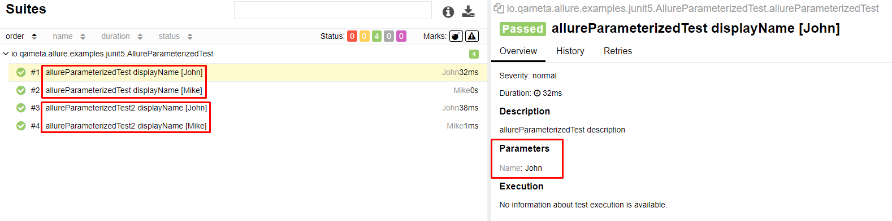
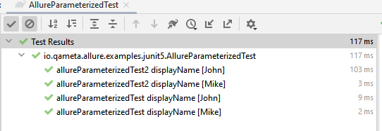
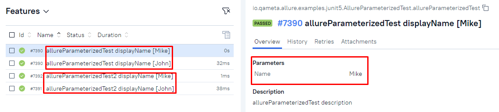
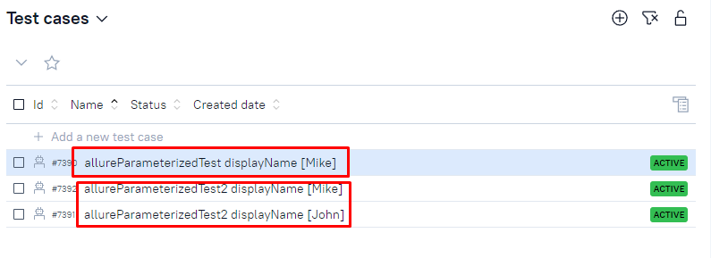
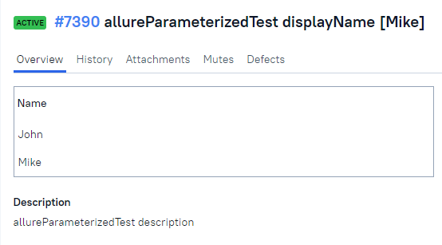
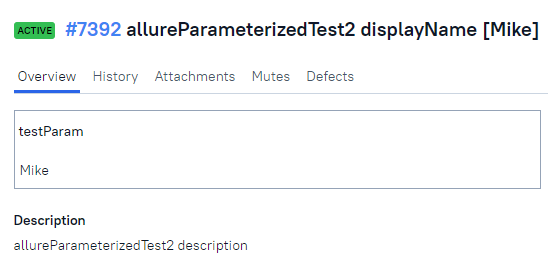

# allure testops parametrized test

This project has example, how to work with parametrized tests in Allure TestOps (and in Report)

Here is example of two tests in java (junit5)

    @ParameterizedTest(name = "{displayName} [{argumentsWithNames}]")
    @ValueSource(strings = {"John", "Mike"})
    @DisplayName("allureParameterizedTest displayName")
    @Description("allureParameterizedTest description")
    public void allureParameterizedTest(String name) {
        Allure.parameter("Name", name);
    }

    @ParameterizedTest(name = "{displayName} [{argumentsWithNames}]")
    @ValueSource(strings = {"John", "Mike"})
    @DisplayName("allureParameterizedTest2 displayName")
    @Description("allureParameterizedTest2 description")
    public void allureParameterizedTest2(String testParam) {
        Allure.parameter("testParam", testParam);
        Allure.getLifecycle().updateTestCase(test -> {
            test.setFullName("allureParameterizedTest2 displayName for " + testParam);
        });
    }

In Allure Report they look similar

Also in IDE run

In Allure TestOps launch also similar

But in `Test Cases` section there is difference

Test Case `allureParameterizedTest` looks like one, but with two different param values

But `allureParameterizedTest2` has two Test Cases for each param value

